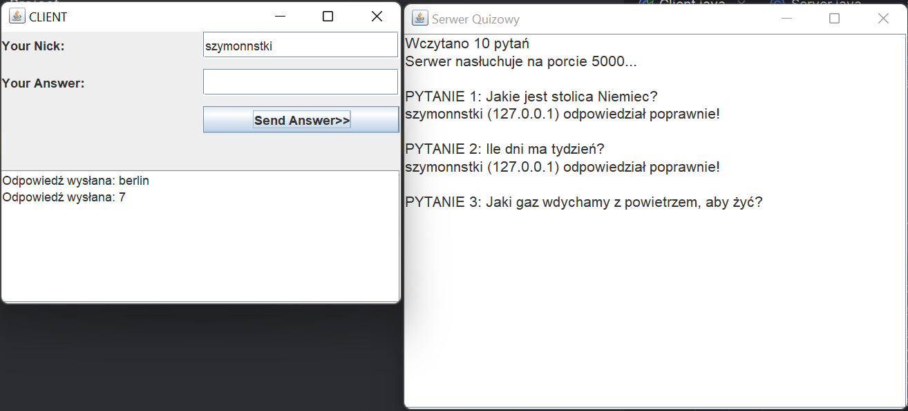

# Aplikacja: Gra pytania-odpowiedzi

## Opis

Aplikacja składa się z dwóch oddzielnych komponentów: **serwera** oraz **klienta**, które komunikują się wyłącznie w kierunku **klient → serwer**. Serwer pełni rolę centrum, zarządzającego pytaniami oraz oceną odpowiedzi, podczas gdy klient umożliwia graczowi udzielanie odpowiedzi na zadawane pytania.

## Działanie aplikacji

### Serwer:
- Po uruchomieniu serwera, pytania wczytywane są z pliku tekstowego do struktury danych (np. mapy), co pozwala na łatwe sprawdzanie nadesłanych odpowiedzi.
- **Format pytań w pliku**: każda linia zawiera pytanie i odpowiedź, rozdzielone separatorem `|` (np. `Pytanie?|Odpowiedź`).
- Serwer po uruchomieniu wyświetla pierwsze pytanie i nasłuchuje na odpowiednim porcie nadchodzące odpowiedzi.
- Po otrzymaniu odpowiedzi, proces przetwarzania odbywa się przy użyciu modelu **Producent-Konsument**:
  - **Producent** nasłuchuje odpowiedzi na osobnym wątku i umieszcza je w kolejce blokującej.
  - **Konsument** analizuje odpowiedzi i steruje aplikacją, weryfikując poprawność odpowiedzi.

### Klient:
- Klient umożliwia graczowi podanie swoich danych (np. imienia) oraz wysyłanie odpowiedzi na wyświetlane pytania po ich wpisaniu.
- Odpowiedzi są przesyłane do serwera po kliknięciu przycisku "Send Answer".
- Klient wyświetla wyniki odpowiedzi, które są analizowane przez serwer. Poprawne odpowiedzi prowadzą do wyświetlenia informacji o graczu, który udzielił poprawnej odpowiedzi jako pierwszy.

## Przepływ gry:
1. **Serwer** wyświetla pytanie.
2. **Klient** wysyła odpowiedź.
3. **Producent** nasłuchuje odpowiedzi i umieszcza je w kolejce blokującej.
4. **Konsument** analizuje odpowiedź:
   - Jeśli odpowiedź jest poprawna, wyświetlana jest informacja o graczu, oczyszczana jest kolejka, a serwer przechodzi do następnego pytania.
   - Jeśli odpowiedź jest błędna, wyświetlany jest stosowny komunikat.
5. Gra kończy się po udzieleniu poprawnych odpowiedzi na wszystkie pytania.

## Technologie:
- **Model Producent-Konsument**
- **Kolejka blokująca**
- **Wątki (wielozadaniowość)**

## Instrukcja uruchomienia:
1. Uruchom **serwer**, który wczyta pytania z pliku tekstowego.
2. Uruchom **klienta**, który umożliwi wprowadzenie odpowiedzi i przesyłanie ich do serwera.
3. Gra rozpocznie się automatycznie, wyświetlając pytania i oczekując na odpowiedzi.
